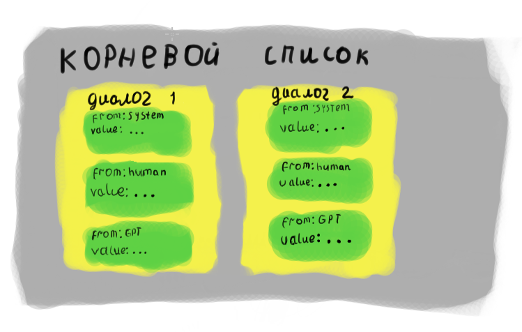

Этот репозиторий создан для сбора датасетов на русском для файн-тюнинга LLM.
Изначально этот репозиторий создан для моего Telegram бота, но также датасеты могут использоваться в любом проекте и для любых целей.

Предпологается, что файл имеет тематическое имя, напр. [hytale.json](datasets/hytale.json) для информации про Hytale.
Каждый диалог в датасете должен состоять из системного промпта в первом сообщении и диалога пользователя и LLM в последующем.
Важно, чтобы системный промпт имел больше приоритета чем запросы пользователя, а ответы LLM были корректны и соответствовали системному промпту.
Например, LLM не может давать неверную информацию, если этого не требует системный промпт, а также не может цензурировать ответы, если этого не требует системный промпт.

В первую очередь приветствуются два типа датасетов:
- Нетривиальное поведение LLM, определённое системным промптом.
- Новая информация.


Датасеты храняться в JSON формате в папке datasets репозитория, в формате ShareGPT.
Вот пример из [документации Unsloth](https://docs.unsloth.ai/basics/chat-templates) (конвертированный в JSON):
```json
[
    [{"from": "human", "value": "Hi there!"},
     {"from": "gpt", "value": "Hi how can I help?"},
     {"from": "human", "value": "What is 2+2?"}],
    [{"from": "human", "value": "What's your name?"},
     {"from": "gpt", "value": "I'm Daniel!"},
     {"from": "human", "value": "Ok! Nice!"},
     {"from": "gpt", "value": "What can I do for you?"},
     {"from": "human", "value": "Oh nothing :)"}],
]
```

Структура файла датасета состоит из корневого списка, содержащего списки с диалогами, где каждое сообщение это словарь, с полями `from` и `value`, где значение `from` должно быть одним из `system`/`human`/`gpt`, а значение `value` - содержимое сообщения.




Чтобы добавить свой датасет или внести изменения в существующий, создайте форк репозитория, внесите нужные изменение и отправьте Pull Request. Если всё верно, через некоторое время его примут. Если нет - укажут, что надо исправить.
Также, приветствуется улучшение README.

Условия для добавления или дополнения датасета:
- Сообщения не должны быть сгенерированы искуственно.
- Сообщения должны быть получены законным путём и не нарушать авторское право.
- Сообщения должны быть на русском или английском языке. Допускаются короткие вставки на других языках, но основным языком должен быть русский либо английский.
- Сообщения не должны повторяться среди разных диалогов или разных датасетов. Сообщений не должны быть скопированы из другого датасета, существующего в Интернете (исключение - датасеты, не опубликованные ранее в формате ShareGPT).
- Сообщения должны быть логичными и вписываться в контекст, LLM по умолчанию должна себя вести как ИИ чат-бот, если в системном промпте не указано иначе.
- Ответы LLM могут использовать только информацию, предоставленную внутри диалога, без чтения из внешних источников, если это не делается явно.
- Обязателен системный промпт в начале каждого диалога. Системные сообщения также могут быть в любых другие местах диалога, там где это уместно.
- Сообщения не должны содержать незаконной информации или ссылки на незаконную информацию.
- 18+ датасеты должны содержать `explicit` в конце имени файла. Это сделано для того, чтобы те кто будут использовать несколько датасетов из этого репозитория могли отфильтровать 18+ датасеты.
